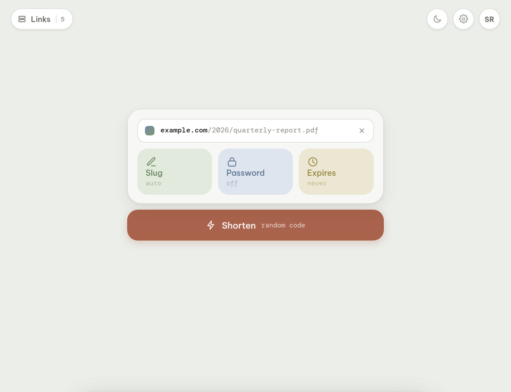
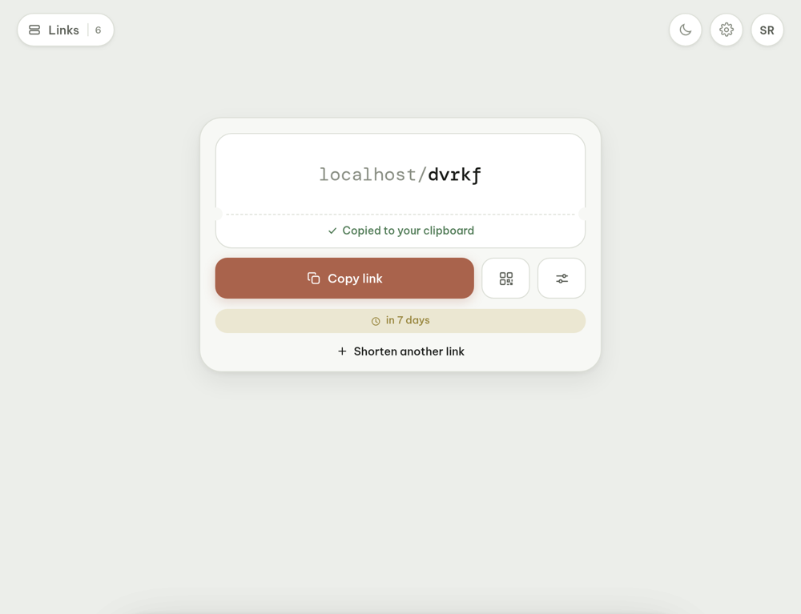
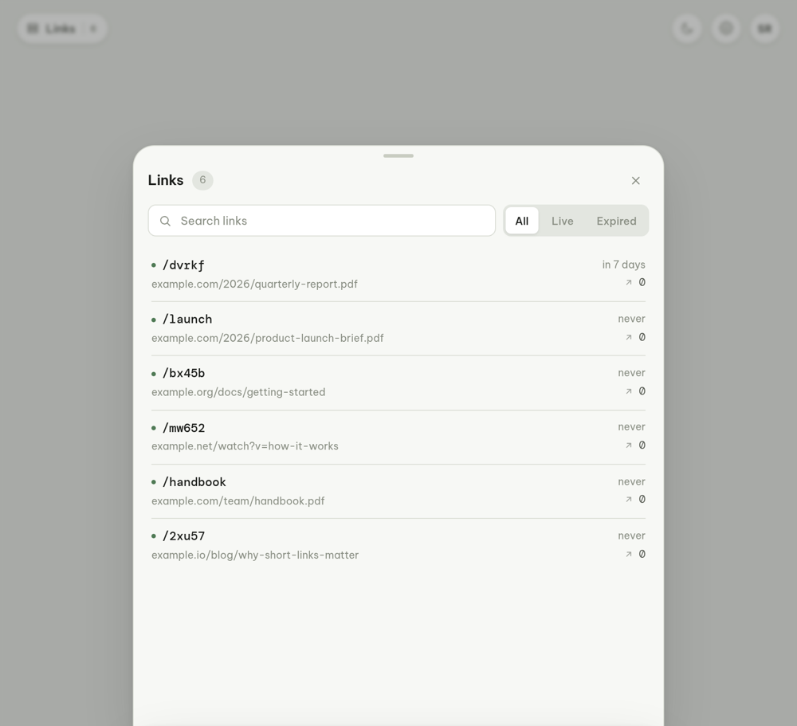
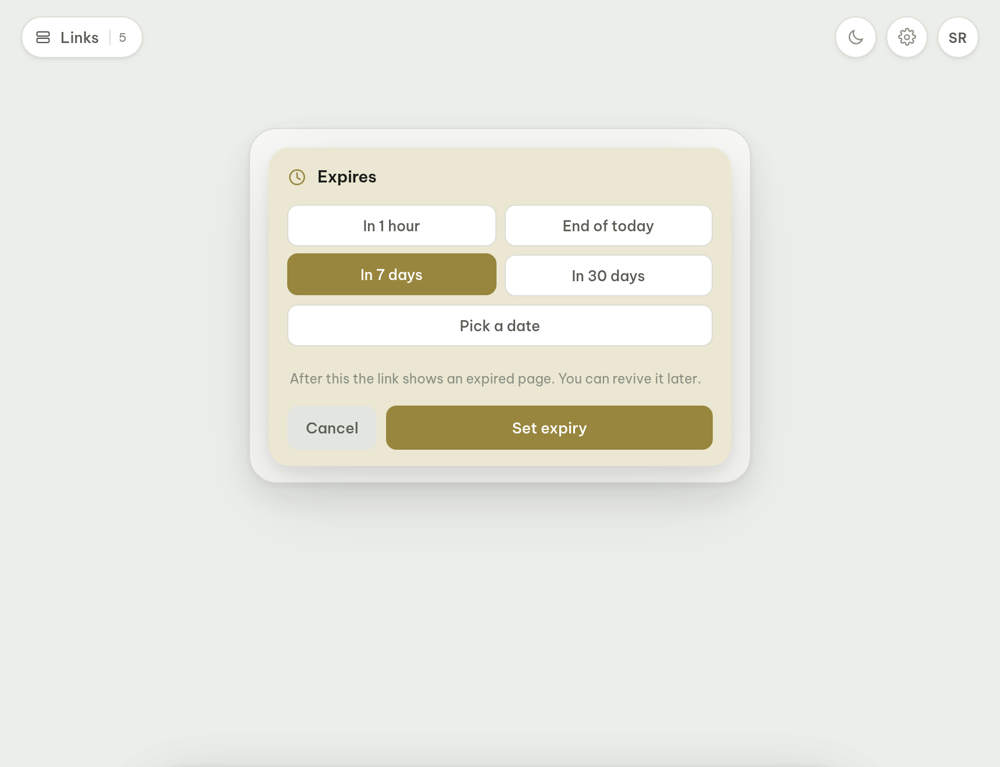
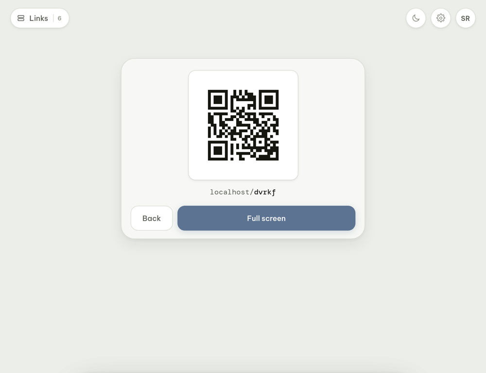
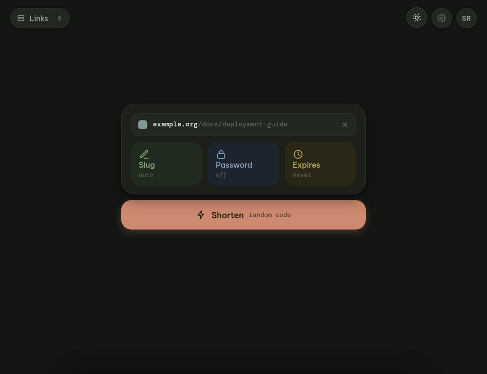
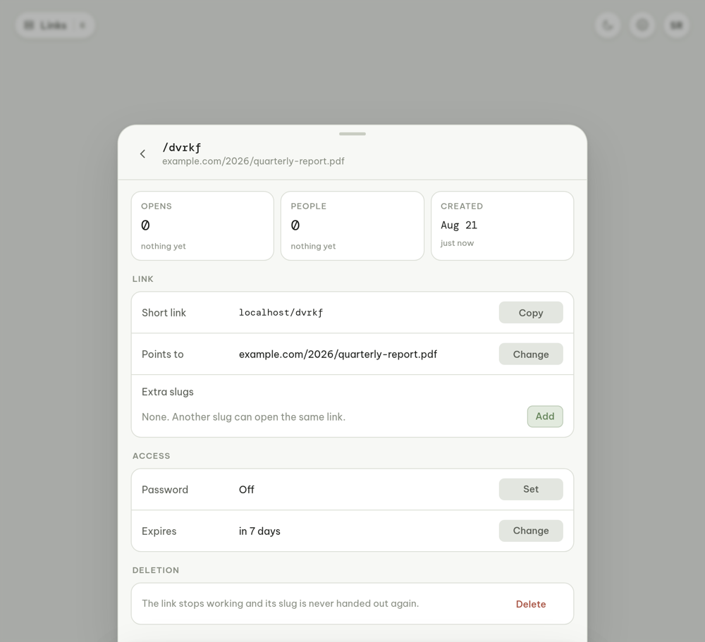
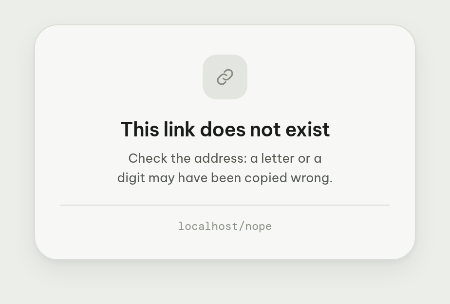

<h1>Wend</h1>

A self-hosted link shortener built around one gesture: open the tab, the link
is already in the box, one tap puts the short URL on your clipboard.

One Go binary, one SQLite file, no other services. Sign-in is delegated to any
OIDC provider, so there are no accounts to manage.



---

## What it does

**Shorten in one move.** The page tries to paste for you on open. Where the
browser refuses — Safari, mostly — the big button does the same in one tap.
Once a link is recognised, the three things you might want to change appear:
a custom slug, a password, an expiry. None of them are required.

**Codes that survive being read aloud.** Generated slugs leave out `i l o 0 1`,
and lookups are case-insensitive, so `/X7KQ2` finds `/x7kq2`.

**A QR code for every link**, full-screen when you need to put one on a wall or
a projector. Generated in-tree; no third-party script draws it.

**A list of every link you've made**, with opens, expiry and quick copy.

|  |  |
|---|---|
|  |  |
|  |  |

**Multiple domains.** Add as many short domains as you like; each link
remembers the one it was created on, so nothing breaks when you add a shorter
one later.

**Passwords and expiry.** A protected link shows a page at its own address
rather than redirecting. An expired link says so, and can be revived on the
same slug — the one people already have.

**It notices repeats.** Paste something you have already shortened and it
offers the existing link instead of quietly making a second one.

**Light and dark**, and it installs as a PWA if you want it to.

|  |  |
|---|---|
|  |  |

---

## Install

Everything is configured through the environment, so the same image works for
anybody: your domains, your identity provider, your name on it.

### 1. Compose

```yaml
services:
  wend:
    image: ghcr.io/collinesfilms/wend:latest
    container_name: wend
    restart: unless-stopped
    ports:
      - "9018:8080"
    volumes:
      - ./data:/data
    env_file:
      - .env
```

### 2. Environment

```env
# Where the interface lives. Doubles as a short domain.
CG_BASE_URL=https://go.example.com
# Short domains, comma separated. The first is the default for new links.
CG_SHORT_DOMAINS=go.example.com

# Any OIDC provider: PocketID, Authentik, Keycloak, Auth0, Google...
CG_OIDC_ISSUER=https://id.example.com
CG_OIDC_CLIENT_ID=
CG_OIDC_CLIENT_SECRET=

# openssl rand -hex 32
CG_SESSION_KEY=

# Optional: put your own name on it.
CG_BRAND_NAME=Wend
CG_TAGLINE=Short links, on your own domain.

CG_TRUST_PROXY=true
TZ=UTC
```

| Variable | Default | What it does |
|---|---|---|
| `CG_BASE_URL` | — | Public address of the interface. Required. |
| `CG_SHORT_DOMAINS` | — | Comma-separated short domains; first one is the default. |
| `CG_OIDC_ISSUER` | — | Your identity provider's URL. Required. |
| `CG_OIDC_CLIENT_ID` / `_SECRET` | — | The OAuth2 client you create there. Required. |
| `CG_SESSION_KEY` | — | 32+ random characters. Changing it signs everyone out; links are untouched. |
| `CG_BRAND_NAME` | `Wend` | The name on the tab and the sign-in page. |
| `CG_TAGLINE` | a neutral line | The line under it. |
| `CG_TRUST_PROXY` | `true` | Read the client address from `X-Forwarded-For`. |
| `CG_LISTEN` | `:8080` | Bind address. |
| `CG_DB_PATH` | `/data/wend.db` | SQLite file. |

The server validates all of it at startup and refuses to run with a list of
what's missing, rather than failing at somebody's first sign-in.

### 3. Identity provider

Create a confidential OAuth2 client with the redirect URL
`https://go.example.com/auth/callback`, then grant it to whoever should be able
to create links. **That grant is the whole authorisation model.** There is no
user management here, no sign-up, no password reset. Revoke access there and it
is revoked here.

### 4. Reverse proxy

Every short domain has to reach the container and have a certificate. Pass the
`Host` header through — it decides which domain a slug is looked up on.

```caddyfile
go.example.com, sho.rt {
    reverse_proxy wend:8080
}
```

### 5. Start

The container does not run as root, so the data directory has to belong to it:

```sh
mkdir -p data && sudo chown -R 10001:10001 data
docker compose up -d
```

Then open your base URL and sign in.

### Backups

Copy `data/wend.db` (plus `-wal` and `-shm` if present). That is the whole
state: links, stats, sessions.

### Updates

```sh
docker compose pull && docker compose up -d
```

The schema is applied at startup. There are no migrations to run.

---

## How it's built

Go and SQLite on the back, React on the front, compiled into a single binary
with the interface embedded. The deployed artefact is one file.

```
cmd/wend            entry point, configuration, graceful shutdown
internal/config     environment, validated all at once at startup
internal/store      SQLite: schema, links, slugs, clicks
internal/auth       OIDC sign-in (PKCE) and sessions
internal/httpx      API, redirect path, server-rendered visitor pages
web/                React interface, embedded into the binary
```

The SQLite driver is pure Go, so building for a NAS's arm64 needs no C
toolchain. Images are built by GitHub Actions for amd64 and arm64.

A few decisions explain most of the behaviour:

**Redirects are 302, never 301.** A 301 is cached permanently by browsers and
proxies, so reviving an expired link or re-pointing one would silently fail for
exactly the people who had already used it.

**A slug is never handed out twice.** Deleting a link retires its slug forever.
Otherwise a link you shared last year could later send someone somewhere new.

**The service worker only caches the interface shell.** Every other navigation
goes straight to the network. A cache answering in place of a redirect would
break links already in circulation, silently, and only for people who use the
interface.

**Stats don't follow anyone.** Unique opens are counted with a hash salted by a
key that rotates daily and is never kept, so it cannot be recomputed or
followed across days. No IP is stored, no cookie is set on the redirect path.

**Fonts are self-hosted.** The error pages are what strangers load; they should
not have to contact a font CDN to be told a link expired.



---

## Development

Go 1.25 and Node 22.

```sh
npm --prefix web ci
npm --prefix web run build     # the binary embeds web/dist
go run ./cmd/wend
```

For interface work, `npm --prefix web run dev` serves the front end with hot
reload and proxies `/api` and `/auth` to the `go run` on :8080.

```sh
go test ./...                  # store and HTTP behaviour
npm --prefix web run typecheck
```

---

## Troubleshooting

**`configuration: ... is required` at startup** — something is missing from the
environment. The message lists everything at once.

**Sign-in loops or errors** — the redirect URL registered with your provider
must be exactly `<CG_BASE_URL>/auth/callback`, and `CG_BASE_URL` must have no
trailing slash.

**A link says it doesn't exist when it does** — the reverse proxy is probably
not passing `Host`. Unknown hosts fall back to the default domain, so this
usually shows up as links resolving on the wrong domain rather than 404s.

**`cannot open the database`** — `data/` doesn't belong to the container user:
`sudo chown -R 10001:10001 data`.

**Start over** — stop the container and delete `data/`.

---

## Licence

MIT.
